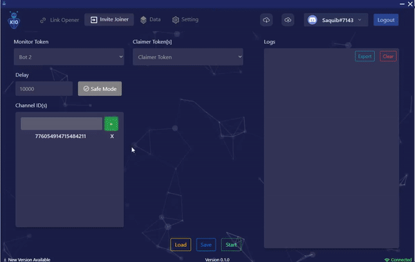
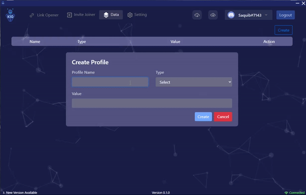
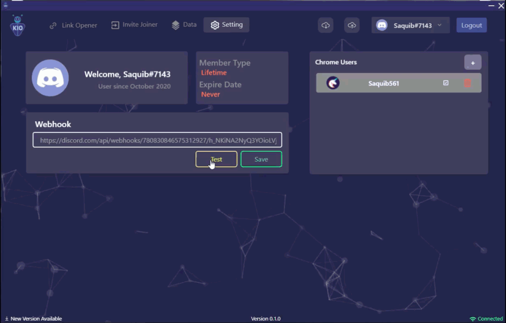

    
    <h1>Usizo: A Komplete LoneWolf</h1>
 </h1>
    

 

 

# Introduction

Usizo helps you to open links and join invites on its own! Usizo is the perfect assistant. It takes you through the discord interface and gives the best experience(UI/UX).

## **Features**

### Link opener

-   Add and remove keywords (Both positive and negative)
-   Url appender
-   Add specific channel ids
-   Ignore Discord/Twitter Links
-   Plays sounds! :you might want to turn your speaker up:

##### _A cool demo_

### Invite Joiner

-   Add delays and let's not get banned
-   Add specific channel ids
-   Add Claimer profiles as how you want to

##### _Another cool demo_

 

### Monitor profiles? Yes! Claimer profiles? Yes again! Chrome profiles?? A big yes!

##### _Watch yourself_

##### _Watch yourself part 2_

- Buy a customized source code as how you want

Want More?

-   Custom Webhooks
-   Logs exporter
-   Logs importer
-   Settings exporter
-   Settings importer
-   Discord Auth
-   Discord rich presence
-   Add/remove chrome user
-   Online/offline detect
-   Profile Show
-   Logout Confirmation
-   Role base Auth
-   Load/Save configs
-   Stop/Start Bot
-   Test webhook instantly and manually

## I want to buy a customized unit but how can I test it first?

-   We have manual setup of discord auth testing so all you need to do is to join our discord [server](https://discord.com/invite/hGS24JC)
-   Ping any Kore member there and get `tester-usizo` role so you can pass through discord auth.
-   Download our electron app for [Windows](https://mega.nz/file/lpoVlYyQ#ROemY2CkJjEB4EDvRvXlfZuhR2awdjfPBfSX6-4i-Dk) & [Mac](https://drive.google.com/file/d/1asdfZcElpEqGlCCSzUHUFISCGJc8o0Av/view?usp=sharing)

## ℹ️ I have a question.

Have a bug or a feature request? Please first read the code of conduct and search for existing and closed issues. If your problem or idea is not addressed yet, [please open a new issue](https://github.com/koders-in/KompleteAIO/issues).

## More on Komplete AIO.

This is the first stable version on **KIO**, throughly tested and binded together just for you. This project is up for maintainance and improvements. However, we've major improvements coming up in future. Want to know more about [koders](https://www.koders.in)? Feel free to ping us.

### Made with ❤️ by [Koders](http://koders.in/)

  

  <i> "Your vision, Our Kreation" </i>
   
   
  An institution that caters to all your software needs with their touch of Koding.
   
  <a href="https://www.koders.in"><strong>Explore More»</strong></a>
   
   
  <a href="https://www.github.com/koders-in">Github</a>
  ·
  <a href="https://www.linkedin.com/company/54359381/">LinkedIn</a>
  ·
  <a href="https://www.youtube.com/channel/UCZ5abFiwqKyJLIQ1Jqb6bNg">Youtube</a>
  ·
  <a href="https://www.instagram.com/koders_in/">Instagram</a>
  ·
  <a href="https://discord.gg/hGS24JC">Discord</a>

