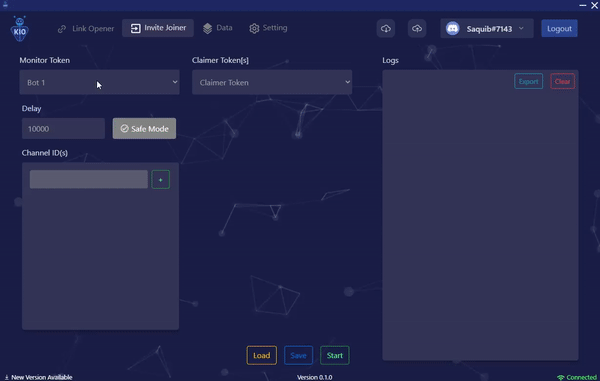

<p align="center">
  <a href="https://koders.in/">
    
  </a>
</p>
<p align="center">
  <i> "Your vision, Our Kreation" </i>
  <br> 
  <br> 
  An institution that caters to all your software needs with their touch of Koding.
  <br>
  <a href="https://www.koders.in"><strong>Explore More»</strong></a>
  <br>
  <br>
  <a href="https://www.github.com/koders-in">Github</a>
  ·
  <a href="https://www.linkedin.com/company/54359381/">LinkedIn</a>
  ·
  <a href="https://www.youtube.com/channel/UCZ5abFiwqKyJLIQ1Jqb6bNg">Youtube</a>
  ·
  <a href="https://www.instagram.com/koders_in/">Instagram</a>
</p>

<br />
<div align="center" >
    
    <h2>Komplete AIO</h2>
  
[](https://github.com/koders-in)
[](https://discord.gg/hGS24JC)
[](https://shields.io/)
[](https://GitHub.com/Naereen/StrapDown.js/graphs/commit-activity)
<br />
[](http://ForTheBadge.com)
</div>
<br />

## 🚀 Getting Started with Link Opener

[📥 Installation](#installation)\
[🔗 Link Opener Guide](#link-opener-guide)<br/>

<a id="installation"><h3>`📥 Installation`</h3></a>

-   Install kompleteaio from exe file

<a id="link-opener-guide"><h2>`🔗 Link Opener Guide`</h2></a>

<div >
    <h2>Link Opener</h2>
    
</div>
<div >
    <h2>Invite Joiner</h2>
    
</div>
<div >
    <h2>Data</h2>
    
</div>
<div >
    <h2>Setting</h2>
    
</div>
### 📃 Content

-   [🔗 Link Opener](#link-opener)
-   [🏠 Invite Joiner](#invite-joiner)
-   [💾 Data](#data)
-   [⚙️ Settings](#settings)

<a id="link-opener" ></a>

## 🔗 Link Opener

-   [Monitor Token](#monitor-token)
-   [Delay](#delay)
-   [URL Appender](#url-appender)
-   [Keywords](#keywords)
-   [Channel Id's](#channelids)
-   [Logs](#logs)

<a id="monitor-token"></a>

#### Monitor Token

-   `These are Monitor Token which is come from Data Page.`

<a id="delay"></a>

#### Delay

-   `Delay is used to prevent the bot from ban from discord server.`

<a id="url-appender"></a>

#### URL Appender

-   `TODO`

<a id="keywords"></a>

#### keywords

-   `The URL containing these keywords are omited.`

<a id="channelids"></a>

#### Channel Id's

-   `Only entered channel id's of the server are monitored.`

<a id="logs"></a>

#### Logs

-   `Used to see what happening like bot is connected or disconnected etc.`

<a id="invite-joiner" ></a>

## 🏠 Invite Joiner

-   `TODO`

<a id="data" ></a>

## 💾 Data

-   `Use to create a Monitor Token.`

<a id="settings" ></a>

## ⚙️ Settings

-   `TODO`

## 📦 What's inside?

```
    main
    development
    feature
```

## ℹ️ Issues

Have a bug or a feature request? Please first read the code of conduct and search for existing and closed issues. If your problem or idea is not addressed yet, [please open a new issue](https://github.com/koders-in/Link-opener-frontEnd/issues).

### Made with ❤️ by [Koders](http://koders.in/)
